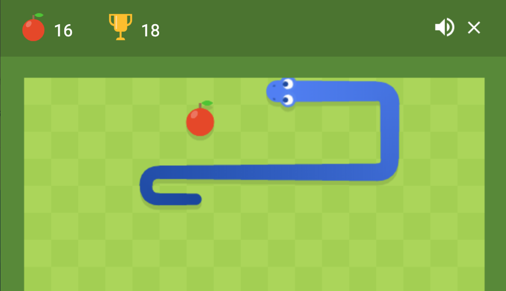

# TP - Viborita

## Introducción
En este trabajo estaremos programando un juego similar al clásico Snake (si no lo conocés podés probarlo [acá](https://www.google.com/search?safe=strict&sxsrf=ALeKk03T1uEo8QvTo8wsIZ0qcB7_U9W-Tw%3A1600819111443&ei=p49qX9KvGtC55OUPhNaj4A4&q=snake+game&oq=snake+game&gs_lcp=CgZwc3ktYWIQAzIECAAQRzIECAAQRzIECAAQRzIECAAQRzIECAAQRzIECAAQRzIECAAQRzIECAAQR1CGA1iGA2CnBGgAcAF4AIABAIgBAJIBAJgBAKABAaoBB2d3cy13aXrIAQjAAQE&sclient=psy-ab&ved=0ahUKEwiSn_Lz-_3rAhXQHLkGHQTrCOwQ4dUDCA0&uact=5)). 

<center>
	
</center>

Como el desarrollo de este juego involucra temas que aún no trabajamos, algunas partes del juego ya te las daremos resueltas y sólo deberás hacer lo que iremos pidiendo más adelante.


## ¿Cómo copio el código para empezar a trabajar?
**A.** Para copiar el código que te damos hecho tenés que ingresar acá https://repl.it/ e iniciar sesión con tu cuenta.

**B.** Si alguno de tus compañeros YA creó el proyecto para trabajar con este TP, solo debés abrirlo y empezar a trabajar.

**CONTINUAR CON LOS PASOS A CONTINUACIÓN SOLO SI NINGÚN COMPAÑERO DE TU GRUPO CREO EL PROYECTO**

**C.** Si estás en este punto es porque ningún compañero de tu grupo creó el proyecto, en ese caso tenés que seguir [este video](https://web.microsoftstream.com/video/b026685c-5f33-457e-a940-67007ddab0b0?st=106). **El link del repositorio que necesitás para esta actividad es: https://github.com/smschachtner/AP3-ViboritaJS.git**

**D. No te olvides de invitar a los compañeros de tu grupo**. Para hacer esto debés hacer click en share y buscar los usuarios de sus cuentas, o hacer click en `copy link` y compartírselos.

**E. Compartile el proyecto a tu profesor así lo puede corregir**. Para hacer esto debés hacer click en share y buscar la cuenta de tu profesor. Para **3º B** es **JoaquinBlanco**  y para **3º D** es **smschachtner**.

**F.** Por último te pedimos que le **cambies el nombre al proyecto** así están todos ordenados y los podemos encontrar más fácil.

  Esto se logra haciendo click en el lápiz que está cerca de tu nombre de usuario en `repl.it` (arriba a la izquierda en la pantalla).
      
  Los nombres de los proyectos tienen que ser así: `xxxx-AP3-Gyy-TPzz`
      
  Donde `xxxx` corresponde al año, `yy` es el número de grupo y `zz` es el número de TP.
    
Por ejemplo, para el TP 3 del grupo 5 sería: 2020-AP3-G05-TP03

## El proyecto que copié tiene varios archivos... ¿Tengo que conocer todos?
**No, sólo tenés que trabajar en `main.js` y `respuestas.md`**... pero a continuación te contamos los detalles de cada uno.

- `main.js`: es el archivo de código principal, acá vas a tener que ir resolviendo el código que te pidamos.
- `respuestas.md`: es un archivo de texto donde tenés que responder los puntos que sólo hacen preguntas y NO piden código.
- `README.md`: es este archivo que estás viendo, donde está el enunciado. Te recomendamos que NO lo abras desde `repl.it`porque puede hacer que se vea mal, conviene accederlo directamente desde el link que te damos en la tarea de Teams.
- Carpeta `img`: ahí pusimos las imágenes que usa el programa.
- Carpeta `src`: en esta carpeta es donde los profes pusimos el código que les damos hecho y ustedes no deben resolver, por lo tanto **NO tenés que modificarlo y recordá el consejo que le dió el abuelo a Homero el día de su casamiento.**

<center>
  
</center>

## Herramientas utilizadas
Los siguientes procedimientos/funciones te serán útiles para la resolución del TP.

**Te recomendamos que los tengas en cuenta antes de empezar a resolver esta actividad.**

- `direccionViborita()`: función que retorna la dirección (`arriba`, `abajo`, `izquierda` o `derecha`) en la que se está moviendo la viborita.
- `seEnredo(viborita)`: función que retorna `true` si la viborita chocó contra si misma y `false` en caso contrario.
- `posicionEnXDeLaViborita()`: función que retorna la posición de la cabeza de la viborita en el eje `X`.
- `posicionEnYDeLaViborita()`: función que retorna la posición de la cabeza de la viborita en el eje `Y`.
- `anchoDeLaVentana()`: función que retorna el ancho de la ventana del juego.
- `altoDeLaVentana()`: función que retorna el alto de la ventana del juego.
- `posicionEnXDeLaManzana()`: función que retorna la posición de la manzana en el eje `X`.
- `posicionEnYDeLaManzana()`: función que retorna la posición de la manzana en el eje `Y`.
- `console.log()`: recibe como parámetro un mensaje/variable y lo muestra en la consola. Es útil para depurar (encontrar errores) el código).

# Resuelva
**Utilice comentarios e identación.**

1. Para empezar queremos controlar los movimientos de la viborita, para lograr esto debés desarrollar una función llamada `establecerDireccion()` que recibe como parámetro un `keyCode` y debe retornar como resultado las palabras `arriba`, `abajo`, `izquierda` o `derecha` según cuál de las flechas del teclado se presionó.

    Estos son los códigos (`keyCode`) de las teclas:

    | Tecla   | Código |
    | ------- | ------ |
    | `A`     | 65     |
    | &larr;  | 37     |
    | `W`     | 87     |
    | &uarr;  | 38     |
    | `D`     | 68     |
    | &rarr;  | 39     |
    | `S`     | 83     |
    | &darr;  | 40     |

    Tené en cuenta que si el `keyCode` recibido no pertenece a niguna de las teclas mencionadas, la función deberá retornar la dirección que tenía la viborita antes de que se presione la tecla.

    <details>
      <summary>AYUDA: Mmm... no me acuerdo: ¿Qué era eso del keyCode?</summary>
      keyCode: es un código numérico que se le asigna a cada tecla del teclado para identificarlo y que las aplicaciones puedan detectar qué tecla fue presionada o soltada.
    </details>

    <details>
      <summary>AYUDA: ¿Cómo puedo saber que dirección tenía la viborita antes de presionarse la tecla?</summary>
      ¡Revisá más arriba (en este enunciado) las funciones que te damos hechas! Hay una que sirve para eso.
    </details>

    <details>
      <summary>AYUDA: ¿Debo ejecutar esta función o solo implementarla?</summary>
      Sólo debés implementarla, de la ejecución ya nos encargamos nosotros.
    </details>

2. Ahora supongamos que la viborita está yendo hacia la derecha, si inmediatamente se toca la flecha izquierda la viborita cambiará de sentido y empezará a ir **"marcha atrás"**.

    Esta situación no debe suceder en el juego ya que no se puede ir marcha atrás.

    **Modificá el código anterior para que no se permita ir "marcha atrás"**. Por ejemplo si estabamos yendo hacia la derecha, al tocar la flecha izquierda NO debe pasar nada, lo mismo sucede si estabamos yendo hacia abajo y se toca la flecha de arríba.

    <details>
      <summary>AYUDA: ¿Cómo puedo saber que dirección tenía la viborita antes de presionarse la tecla?</summary>
      ¿OTRA VEZ? ¡Revisá más arriba (en este enunciado) las funciones que te damos hechas! Hay una que sirve para eso.
    </details>

    <details>
      <summary>AYUDA: ¡No te olvides de evitar la marcha atrás en las cuatro direcciones!</summary>
    </details>

3. Si no lo hiciste en los puntos anteriores, modificá el procedimiento `establecerDireccion()` para que también permita controlar la viborita mediante las letras `W`, `A`, `S` y `D`.

4. Ahora queremos que la viborita sea capaz de comer la manzana. Gran parte del código que se encarga de esto ya está resuelto, pero nos falta una función que detecte cuando la viborita está en condiciones de comerse a la manzana. **Para esto te pedimos que desarrolles una función llamada `viboritaPuedeComerManzana()` que retorne `true` cuando la viborita pueda comer la manzana y `false` en caso contrario.**

    <details>
      <summary>AYUDA: ¿Cómo puedo saber si la viborita se puede comer a la manzana?</summary>
      La viborita puede comerse a la manzana cuando su cabeza está en la misma posición que la manzana.
    </details>

    <details>
      <summary>AYUDA: ¿Cómo puedo saber las posiciones de la cabeza de la viborita y la manzana?</summary>
      Al estar trabajando en una pantalla de dos dimensiones (2D), una posición se obtiene según los ejes `X` e `Y`.

      Más arriba te dimos un par de funciones que te dan la posición en X e Y para la cabeza de la viborita y otro par de funciones para la manzana.
    </details>

5. Si hiciste lo pedido por el punto anterior, la viborita ya puede comer manzanas y el programa se encarga de varias cosas (poner una manzana nueva, hacer que la viborita crezca, etc.). Pero nos está faltando encargarnos del puntaje del juego.

    Implementá el procedimiento `aumentarPuntaje()` que cumpla con los siguientes requisitos:

    - La variable global `puntaje` debe aumentarse en 1.
    - Cada 2 puntos se debe aumentar la variable global `nivel`.
    - Si se aumenta de nivel se deben aumentar la velocidad del juego, para eso debés aumentar en 2 la variable `fps`.

    <details>
      <summary>AYUDA: ¿Tengo que declarar las variables puntaje, nivel y fps?</summary>
      No, esas variables ya las declaramos nosotros, solo debés usarlas.
    </details>

    <details>
      <summary>AYUDA: ¿Qué son los FPS?</summary>
      Si claro... como si no lo supieras de los jueguitos. Bueno, por las dudas te dejamos [este link](https://es.wikipedia.org/wiki/Fotogramas_por_segundo)
      ```
    </details>


5. Ahora necesitamos contar con una función llamada `perdio()` que retorne `true` si el jugador perdió o `false` en caso contrario.


    Cualquiera de estas condiciones hacen que el jugador pierda:

    - La viborita se fue de los límites de la pantalla.
    - La viborita chocó contra si misma (se enredó).


    <details>
      <summary>AYUDA: ¿Cómo se si la viborita se fue de los límites de la pantalla?</summary>
      Ya te dimos un par de funciones para saber la posición de la cabeza de la viborita. 
      Además te dimos dos funciones más que te indican el ancho y el alto de la pantalla.
      Buscalas más arriba en este enunciado.
    </details>

    <details>
      <summary>AYUDA: ¿Cómo puedo saber si la viborita se enredó/chocó contra si misma?</summary>
      ¿OTRA VEZ? ¡Revisá más arriba (en este enunciado) las funciones que te damos hechas! Hay una que sirve para eso.
    </details>

6. Explique para que sirven los **operadores lógicos** `||` y `&&`.
